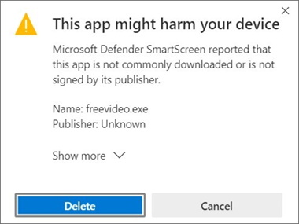
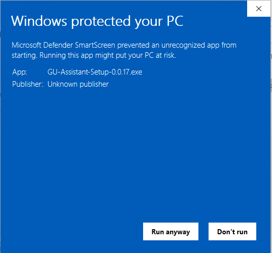

# GU Assistant
Desktop app which helps you predict your opponents next actions while playing God's Unchained.

## Download the application on Edge
Expand overflow with **Show more** and click **Download**

## Run the application on Windows
Expand overflow with **More info** and click **Run anyway**

## Credits
- [changelog-updater](https://stefanzweifel.dev/posts/2021/11/13/introducing-the-changelog-updater-action)
