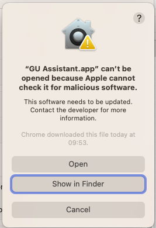
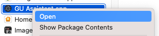
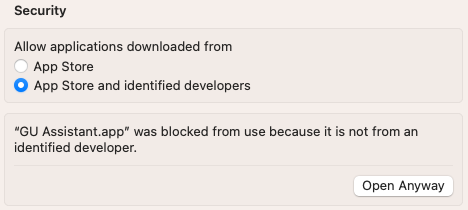

# GU Assistant
Desktop app which helps you predict your opponents next actions while playing God's Unchained.

## Download the application on Edge
Expand overflow with **Show more** and click **Download**

## Run the application on Windows
Expand overflow with **More info** and click **Run anyway**

## Run the application on macOS
MacOS does not allow you to apps downloaded outside of the AppStore. You recieve the following error:

To get around this there are two options:
1. Right click on the app icon and press **Open**

2. Click **Open anyway** in the Security settings

